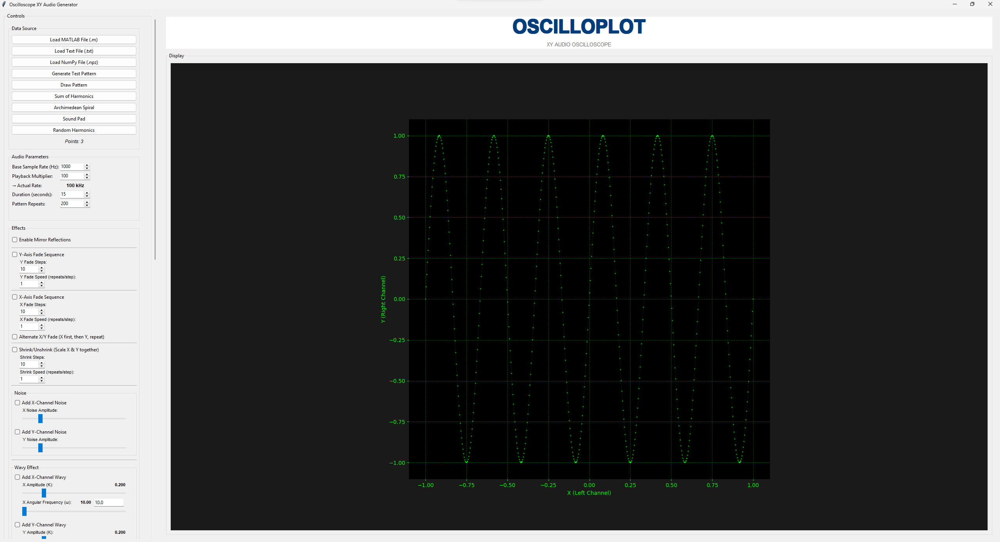
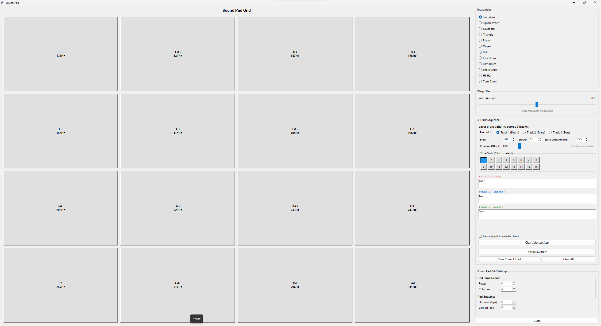
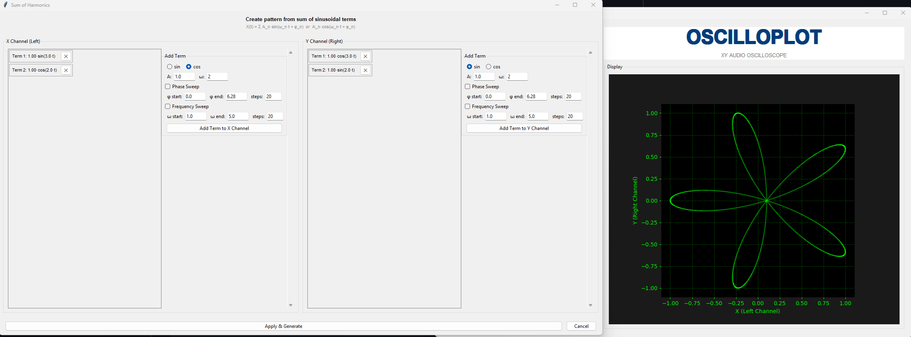
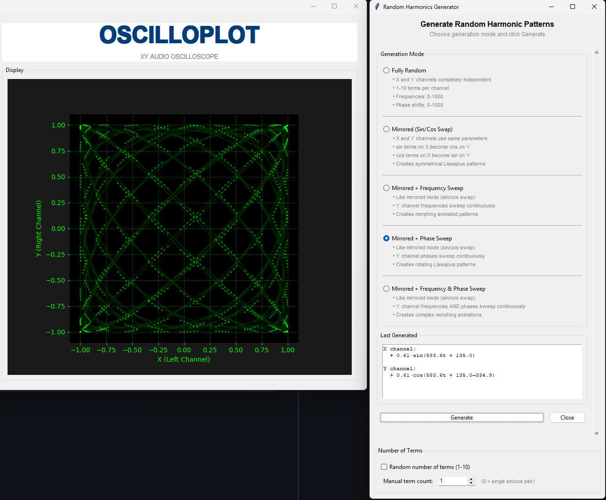
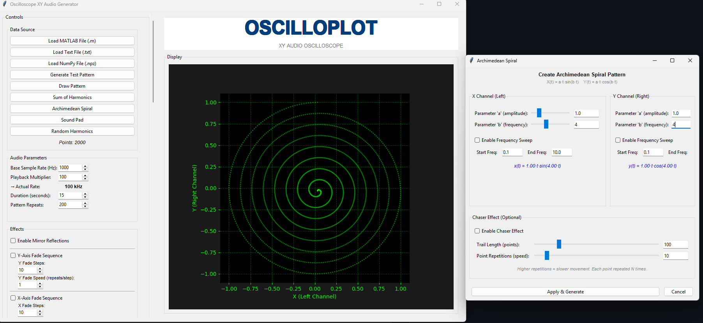
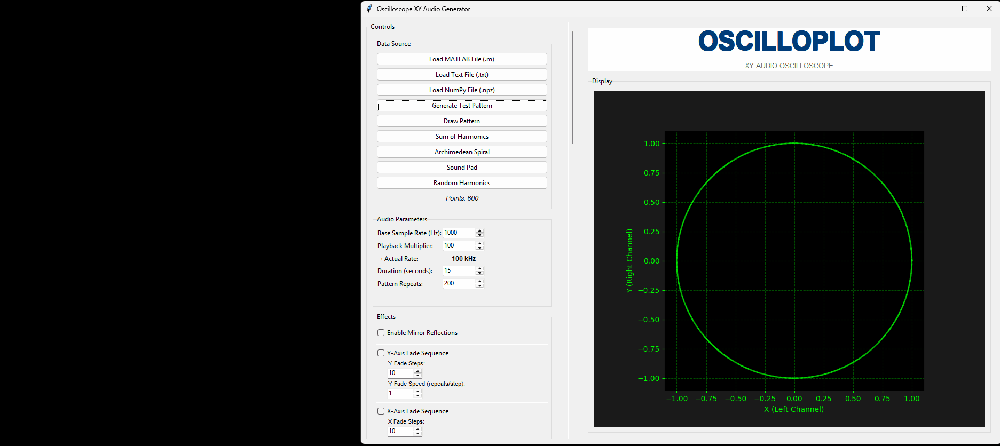
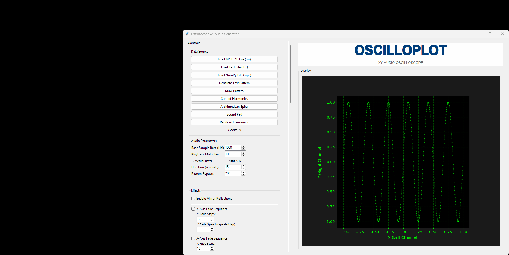

# Oscilloplot - Oscilloscope XY Audio Generator

A powerful Python GUI application for generating XY audio signals that can be displayed on a real analog oscilloscope. Create mesmerizing visual patterns, Lissajous figures, spirals, and custom drawings that come to life on your oscilloscope's phosphor screen!



## Features

- **Real-time XY Oscilloscope Preview** - Classic CRT green phosphor display with density-based rendering
- **Audio Output** - Generate stereo audio signals (Left = X, Right = Y) for real oscilloscope display
- **Multiple Pattern Generators**:
  - Sum of Harmonics (Lissajous figures)
  - Archimedean Spirals
  - Random Harmonics
  - Custom Test Patterns
  - Freehand Drawing Canvas
  - Sound Pad Sequencer (16-step)
- **Image to Coordinates Converter** - Convert photos and drawings to oscilloscope-ready coordinates
- **15+ Real-time Effects** - Rotation, fade, shrink, wavy, tremolo, ring mod, echo, kaleidoscope, distortion, and more
- **Export Options** - Save audio as WAV files
- **Optimized Version** - 10-100x faster rendering with matplotlib blitting

## Screenshots

### Main Application


### Sound Pad


### Sum of Harmonics


### Random Harmonics


### Archimedean Spiral


## Demo GIFs

### Draw Pattern


### Effects Showcase


### Generate Test Pattern


## Installation

### Prerequisites

- Python 3.8 or higher
- A stereo audio output device
- (Optional) An analog oscilloscope in XY mode

### Install Dependencies

```bash
pip install -r requirements.txt
```

Or install manually:

```bash
pip install numpy>=1.20.0 sounddevice>=0.4.0 matplotlib>=3.3.0 soundfile>=0.10.0
```

For the image converter, you'll also need:

```bash
pip install opencv-python
```

## Usage

### Main Application

#### Standard Version
```bash
python oscilloscope_gui.py
```

#### Optimized Version (Recommended)
```bash
python oscilloscope_gui_optimized.py
```

The optimized version provides dramatically better performance:
- 50-90% lower CPU usage
- 10-100x faster rendering
- Smoother animations at 50 FPS

### Quick Start

1. **Launch the application** - Run `oscilloscope_gui.py` or `oscilloscope_gui_optimized.py`
2. **Load or generate a pattern**:
   - Click "Generate Test Pattern" for a quick demo
   - Click "Sum of Harmonics" to create Lissajous figures
   - Click "Draw Pattern" to draw your own shape
3. **Adjust parameters** using the control panel on the left
4. **Click Play** to hear the audio and see the live preview
5. **Connect to oscilloscope** - Route stereo audio output to your scope's X and Y inputs

---

## Complete Function Reference

### Data Source Functions

| Button | Description |
|--------|-------------|
| **Load MATLAB File (.m)** | Load X/Y coordinate arrays from MATLAB format files. Expected variables: `x_fun` and `y_fun` |
| **Load Text File (.txt)** | Load coordinates from plain text files with `x_fun=[...]` and `y_fun=[...]` format |
| **Load NumPy File (.npz)** | Load coordinates from NumPy compressed archives with `x` and `y` arrays |
| **Generate Test Pattern** | Creates a simple test pattern (default sine wave) for quick testing |
| **Draw Pattern** | Opens an interactive canvas where you can draw patterns freehand with your mouse |
| **Sum of Harmonics** | Opens a dialog to create Lissajous figures by combining multiple sine waves |
| **Archimedean Spiral** | Opens a dialog to generate spiral patterns with configurable parameters |
| **Sound Pad** | Opens a 16-step sequencer for creating rhythmic patterns |
| **Random Harmonics** | Generates random Lissajous-like patterns with random frequencies, phases, and amplitudes |

---

### Audio Parameters

| Parameter | Range | Description |
|-----------|-------|-------------|
| **Base Sample Rate (Hz)** | 100-10,000 | The base sampling rate for the pattern. Higher = more detail but larger files |
| **Playback Multiplier** | 10-500 | Multiplies the base rate for actual audio output. `Base Rate × Multiplier = Actual Rate` |
| **Actual Rate** | (calculated) | Shows the resulting sample rate (e.g., 1000 Hz × 100 = 100 kHz) |
| **Duration (seconds)** | 5-120 | Total playback duration of the generated audio |
| **Pattern Repeats** | 1-2000 | How many times the pattern repeats. More repeats = smoother effects like rotation |

---

### Effects - Complete Reference

#### Mirror Reflections
- **Enable Mirror Reflections**: Creates mirror copies of the pattern across axes
- Creates symmetrical visual effects

#### Y-Axis Fade Sequence
Gradually fades the pattern in/out along the Y-axis:
| Parameter | Description |
|-----------|-------------|
| **Y Fade Steps** | Number of fade levels (2-50). More steps = smoother fade |
| **Y Fade Speed** | Repeats per step (1-20). Lower = slower fade animation |

#### X-Axis Fade Sequence
Gradually fades the pattern in/out along the X-axis:
| Parameter | Description |
|-----------|-------------|
| **X Fade Steps** | Number of fade levels (2-50). More steps = smoother fade |
| **X Fade Speed** | Repeats per step (1-20). Lower = slower fade animation |

#### Alternate X/Y Fade
- When enabled, alternates between X and Y fading (X fades first, then Y, then repeats)
- Creates a "breathing" or pulsing effect on different axes

#### Shrink/Unshrink
Scales the entire pattern uniformly (both X and Y together):
| Parameter | Description |
|-----------|-------------|
| **Shrink Steps** | Number of scale levels (2-50) |
| **Shrink Speed** | Repeats per step (1-20). Controls animation speed |

#### Noise Effects
Add random noise to create organic, jittery effects:

**X-Channel Noise:**
| Parameter | Description |
|-----------|-------------|
| **Enable** | Toggles noise on the X channel |
| **X Noise Amplitude** | Noise intensity (0.001-0.3). Higher = more jitter |

**Y-Channel Noise:**
| Parameter | Description |
|-----------|-------------|
| **Enable** | Toggles noise on the Y channel |
| **Y Noise Amplitude** | Noise intensity (0.001-0.3). Higher = more jitter |

#### Wavy Effect
Adds sinusoidal modulation to create wobbling/undulating patterns:

**X-Channel Wavy:**
| Parameter | Description |
|-----------|-------------|
| **Enable** | Toggles wavy effect on X channel |
| **X Amplitude (K)** | Wave amplitude (0.0-1.0). Higher = more pronounced waves |
| **X Angular Frequency (ω)** | Wave frequency (1-1,000,000). Higher = faster oscillation |

**Y-Channel Wavy:**
| Parameter | Description |
|-----------|-------------|
| **Enable** | Toggles wavy effect on Y channel |
| **Y Amplitude (K)** | Wave amplitude (0.0-1.0) |
| **Y Angular Frequency (ω)** | Wave frequency (1-1,000,000) |

**Formula:** `output = input + K × sin(ω × t)`

#### Rotation
Rotates the entire pattern around the center:

| Mode | Description |
|------|-------------|
| **Off** | No rotation applied |
| **Static Angle** | Fixed rotation at specified angle (-180° to +180°) |
| **Rotate Clockwise (CW)** | Continuous clockwise rotation |
| **Rotate Counter-Clockwise (CCW)** | Continuous counter-clockwise rotation |

| Parameter | Description |
|-----------|-------------|
| **Static Angle** | Fixed rotation angle in degrees (-180 to 180) |
| **Rotation Speed** | Degrees per pattern cycle (0.5-45). `360° ÷ speed = steps per full rotation` |

**Tip:** More Pattern Repeats = more complete rotations during playback

#### Tremolo (Amplitude Modulation)
Modulates the signal amplitude to create pulsing/throbbing effects:

| Parameter | Description |
|-----------|-------------|
| **Enable Tremolo** | Toggles the effect |
| **Depth (%)** | Modulation depth (0-100%). 100% = full amplitude variation |
| **Rate (Hz)** | Modulation frequency (0.1-20 Hz). How fast the amplitude pulses |
| **Waveform** | Shape of modulation: **Sine** (smooth), **Triangle** (linear), **Square** (on/off) |

#### Ring Modulation
Multiplies the signal with a carrier wave for metallic/robotic effects:

| Parameter | Description |
|-----------|-------------|
| **Enable Ring Modulation** | Toggles the effect |
| **Carrier Freq (Hz)** | Carrier frequency (10-2000 Hz). Creates sidebands around original frequencies |
| **Mix (%)** | Wet/dry mix (0-100%). 0% = original, 100% = fully modulated |

#### Echo/Delay
Creates repeating echoes of the pattern:

| Parameter | Description |
|-----------|-------------|
| **Enable Echo** | Toggles the effect |
| **Number of Echoes** | How many echoes (1-10) |
| **Decay Factor** | Volume reduction per echo (0.1-0.95). Higher = echoes last longer |
| **Delay Time (%)** | Echo spacing as % of pattern length (1-50%) |

#### Kaleidoscope
Creates symmetrical copies of the pattern around the center:

| Parameter | Description |
|-----------|-------------|
| **Enable Kaleidoscope** | Toggles the effect |
| **Symmetry Sections** | Number of copies (2-12). 6 = hexagonal symmetry |
| **Mirror Reflections** | When enabled, alternating sections are mirrored |

#### Distortion
Clips or folds the signal for aggressive visual effects:

| Parameter | Description |
|-----------|-------------|
| **Enable Distortion** | Toggles the effect |
| **Type** | **Soft Clip** (smooth saturation), **Hard Clip** (sharp cutoff), **Fold** (wraps around) |
| **Threshold** | Clipping threshold (0.1-2.0). Lower = more distortion |

---

### Live Preview Settings

| Setting | Description |
|---------|-------------|
| **Live Preview** | Toggle real-time display during playback |
| **Window Size** | Number of samples shown (100-50,000). Larger = more pattern visible but uses more CPU |
| **Frame Rate** | Preview FPS (5-60). Higher = smoother but uses more CPU |

---

### Action Buttons

| Button | Description |
|--------|-------------|
| **Apply & Generate** | Applies all current settings and generates the audio. Press after changing parameters |
| **Play Audio** | Starts/stops audio playback and live preview |
| **Reset Effects** | Resets all effects to their default (off) state |
| **Save to WAV** | Exports the generated audio to a stereo WAV file |

---

## Pattern Generators - Detailed

### Sum of Harmonics
Create Lissajous figures by combining multiple sine waves:

**X Channel:** `X = A₁·sin(f₁·t + φ₁) + A₂·sin(f₂·t + φ₂) + ...`
**Y Channel:** `Y = B₁·sin(g₁·t + ψ₁) + B₂·sin(g₂·t + ψ₂) + ...`

Each harmonic has:
- **Amplitude (A, B)** - Wave height
- **Frequency (f, g)** - Oscillation speed (integer ratios create closed figures)
- **Phase (φ, ψ)** - Starting position offset

**Classic Lissajous ratios:**
| X:Y Ratio | Shape |
|-----------|-------|
| 1:1 | Circle/Ellipse/Line |
| 1:2 | Figure-8 |
| 2:3 | Pretzel shape |
| 3:4 | Complex loop |

### Archimedean Spiral
Generate spiral patterns using polar coordinates:

**Formula:** `r = a + b·θ`

| Parameter | Description |
|-----------|-------------|
| **a** | Starting radius (inner size) |
| **b** | Growth rate (spacing between loops) |
| **Turns** | Number of spiral rotations |

**Cartesian conversion:**
- `X = r·cos(θ)`
- `Y = r·sin(θ)`

### Sound Pad Sequencer
A 16-step pattern sequencer:

| Feature | Description |
|---------|-------------|
| **16 Time Slots** | Click to select/edit each step |
| **Grid Pattern** | Set X/Y values for each step |
| **Position Offset** | Shifts the entire pattern |
| **Clear Step** | Remove data from selected step |

### Random Harmonics
Generates random but pleasing Lissajous-like patterns:
- Random integer frequency ratios (creates closed figures)
- Random phase offsets
- Random amplitudes
- Click again to generate a new random pattern

---

## Image to Coordinates Converter (`img2txt.py`)

Convert photos and drawings into XY coordinates for oscilloscope display.

### Usage
```bash
# Basic usage
python img2txt.py <image_path> [num_points]

# With interactive editor
python img2txt.py <image_path> [num_points] --edit
```

### Examples
```bash
# Convert a photo with 2000 points and open editor
python img2txt.py photo.jpg 2000 --edit

# Quick convert a line drawing
python img2txt.py drawing.png 1000

# Auto-process with default settings
python img2txt.py logo.png
```

### Processing Methods
| Method | Description | Best For |
|--------|-------------|----------|
| **Simple** | Basic sharpening | Quick processing, clean line art |
| **Bilateral** | Noise reduction + edge preservation | Photos (recommended) |
| **DoG** | Difference of Gaussians | Artistic line drawings |

### Thresholding Modes
- **Binary** - Simple threshold (adjustable 0-255)
- **Adaptive** - Auto-adjusts for varying lighting (best for photos)

### Interactive Editor Controls
| Control | Action |
|---------|--------|
| Left Drag | Erase points |
| Right Drag | Add points |
| Scroll | Adjust radius |
| TAB | Toggle erase/add mode |
| S | Save coordinates |
| R | Reset to original |
| Q | Quit |

### Output
Creates a `coordinates.txt` file that can be loaded in the main application.

---

## File Formats

### Loading Patterns

**MATLAB Format (.m)**
```matlab
x_fun = [0.0, 0.1, 0.2, ...];
y_fun = [0.5, 0.6, 0.7, ...];
```

**Text Format (.txt)**
```
x_fun=[0.0,0.1,0.2,...];
y_fun=[0.5,0.6,0.7,...];
```

**NumPy Format (.npz)**
```python
import numpy as np
np.savez('pattern.npz', x=x_coords, y=y_coords)
```

### Export Format

**WAV Audio** - Stereo 16-bit PCM
- Left channel: X coordinates
- Right channel: Y coordinates

---

## Connecting to an Oscilloscope

1. **Set oscilloscope to XY mode** (also called X-Y, dual channel, or Lissajous mode)
2. **Connect audio output**:
   - Left channel → X input (Channel 1)
   - Right channel → Y input (Channel 2)
3. **Adjust oscilloscope settings**:
   - Set time/div to external or X-Y mode
   - Adjust gain on both channels equally
   - Set coupling to AC or DC depending on your pattern

**Recommended Audio Settings:**
- Sample Rate: 100-200 kHz (1000 Hz × 100-200 multiplier)
- Duration: 1-2 seconds for smooth looping

---

## Optimized Version

The optimized version (`oscilloscope_gui_optimized.py`) provides dramatically better performance:

### Key Optimizations
- **Matplotlib Blitting** - Only redraws changed elements (10-100x faster)
- **Circular NumPy Buffers** - Pre-allocated arrays eliminate memory allocations
- **Smart Decimation** - Adaptive downsampling for smooth rendering
- **Cached Background** - Background saved and restored for each frame

### Performance Comparison

| Metric | Original | Optimized |
|--------|----------|-----------|
| CPU Usage | 40-80% | 5-15% |
| Frame Time | 50-200ms | 2-8ms |
| Memory Allocs/sec | ~500 | ~10 |

### When to Use
- For general use (recommended)
- When using large window sizes (>5,000 samples)
- When CPU usage is a concern
- For longer sessions or presentations

---

## Additional Documentation

- **[OPTIMIZATION_README.md](OPTIMIZATION_README.md)** - Detailed optimization techniques
- **[QUICK_START_OPTIMIZED.md](QUICK_START_OPTIMIZED.md)** - Quick start for optimized version
- **[DENSITY_RENDERING.md](DENSITY_RENDERING.md)** - How density-based rendering works

---

## Troubleshooting

### No audio output
- Check that your audio device is selected in system settings
- Verify the sample rate is supported by your sound card
- Try lowering the playback multiplier

### Laggy preview
- Use the optimized version (`oscilloscope_gui_optimized.py`)
- Reduce window size in Live Preview settings
- Lower the FPS setting

### Image converter errors
- Ensure OpenCV is installed: `pip install opencv-python`
- Try different processing methods (Simple, Bilateral, DoG)
- Use the `--edit` flag to adjust parameters interactively

### Pattern looks wrong on oscilloscope
- Check X/Y channel connections aren't swapped
- Ensure both channels have the same gain setting
- Verify oscilloscope is in XY mode, not time-base mode

### Effects not visible
- Click "Apply & Generate" after changing effect settings
- Ensure effect checkbox is enabled
- Try increasing effect parameters (amplitude, depth, etc.)

---

## To Do

- [ ] Further optimize

---

## License

This project is open source. Feel free to use, modify, and distribute.

---

## Contributing

Contributions are welcome! Feel free to:
- Report bugs
- Suggest features
- Submit pull requests

---

## Credits

**Oscilloplot** - Inspired by classic Tektronix oscilloscopes from the 90s.

Built with:
- Python
- NumPy
- Matplotlib
- sounddevice
- Tkinter
- OpenCV (for image processing)
